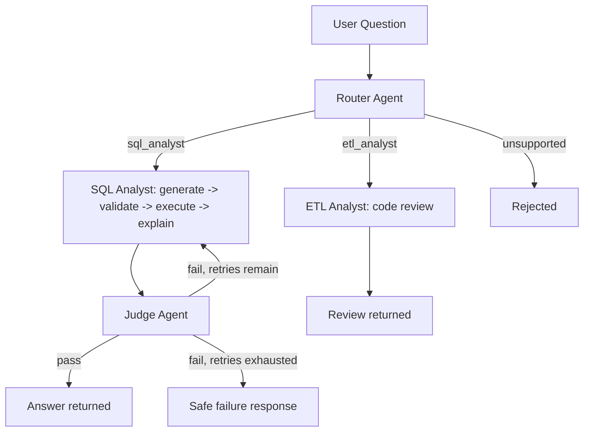

# Multi-Agent AI Data Analytics Platform

A production-style multi-agent system that answers natural-language questions about a database and reviews ETL code for data-quality issues - built with an emphasis on **verifiable safety** rather than blind trust in AI-generated output.

A user asks a question in plain English. A Router agent classifies intent and rejects unsafe or out-of-scope requests. A SQL Analyst agent writes and validates SQL, executes it read-only, and explains the result in plain business language. A Judge agent independently checks the answer against the raw data before it reaches the user, with a bounded automatic retry loop on failure. An ETL Analyst agent separately reviews pipeline code for bugs. Every request is traced end-to-end.

## Architecture



Built with Python, LangChain, LangGraph, Pydantic, PostgreSQL, SQLAlchemy, and Streamlit. The LLM provider (currently Ollama, running `llama3.2:3b` fully locally) and the database backend (currently Postgres) are both swapped via a config value, not a code change - see "Design decisions" below.

## Security model: defense in depth

Two independent layers, so a bug in one does not compromise the data:

1. **Structural SQL validation** (`sqlglot`-based, not keyword-matching) - rejects anything that isn't a single, safe `SELECT` statement against an approved table list, and enforces a row limit. Catches disguised or obfuscated destructive queries a naive regex would miss.
2. **A dedicated read-only Postgres role** - the application executes all AI-generated queries through a database user that is physically incapable of writing, regardless of what the validator does or doesn't catch.

A real example from testing: the SQL generator once produced a `UNION ALL SELECT * FROM <every table>` query attempting to dump the entire database. The structural validator correctly rejected it on all 3 retry attempts, because `UNION` is not a `SELECT`-shaped statement.

## Design decisions

- **`DatabaseAdapter` abstraction** (`src/ai_data_agent/db/`): agents never talk to Postgres directly. They depend only on an abstract contract (`execute_query`, `get_schema_summary`, `close`). A `SnowflakeAdapter` implementing the same contract exists alongside `PostgresAdapter`, proving the system can swap warehouses via one config value (`DB_PROVIDER`) with zero changes to agent logic.
- **Provider-agnostic LLM interface** (`src/ai_data_agent/llm/provider.py`): agents ask for a chat model, not for Ollama specifically. Swapping to a hosted model provider is a config change.
- **A narrowed, honest Judge**: an early, broader Judge prompt proved unreliable on a 3B-parameter local model - it failed genuinely correct answers over confused, overly literal reasoning. Rather than ship a Judge that produced false confidence, its scope was deliberately narrowed to a single, reliably-checkable task (does the stated number match the query result?), with the remaining gap documented rather than hidden.

## Known limitations (documented, not hidden)

- The SQL generator can hallucinate invalid filter values (e.g. inventing a status like `'no-show'` that doesn't exist in the schema) when a question is phrased ambiguously. Caught by neither the structural validator (checks safety, not semantic correctness) nor the current Judge (checks number-matching, not query intent). Logged as a named case in the eval dataset.
- The Router is not fully deterministic even at `temperature=0` on this model - the same question can occasionally route differently between runs.
- The Judge occasionally raises stylistic objections despite being explicitly instructed to ignore wording - a real, observed limitation of small-model instruction-following under compound tasks.
- This is a verified prototype of the architecture pattern, not a production deployment - see the "Path to production" section below for the concrete gap list.

## Evaluation

An 8-case eval dataset (`tests/fixtures/eval_dataset.json`) spans valid, ambiguous, adversarial, unsafe, and out-of-scope categories, run automatically end-to-end through the full graph (`tests/run_eval.py`). Current score: 6/8 (75%), with both failures analyzed and documented in `tests/fixtures/eval_findings.md`. 13 additional pytest unit tests cover the SQL validator and state schema deterministically.

## Path to production

This project deliberately proves a pattern rather than being production-ready as-is. The concrete gaps to close:
- Async/queued request handling instead of synchronous, blocking calls
- A hosted or higher-throughput model instead of a local 3B model, for concurrency and reliability
- Connection pooling tuned for concurrent users
- Shipping the existing structured traces to a real observability platform with alerting
- Role-based access control per user/stakeholder
- A CDC-fed incremental data pipeline instead of a static seed dataset

## Running it locally

```bash
git clone https://github.com/vamsikrish69/Multi-Agent-AI-Data-Analytics-Platform.git
cd Multi-Agent-AI-Data-Analytics-Platform
python -m venv .venv
.venv\Scripts\activate          # Windows
pip install -e ".[dev]"
cp .env.example .env            # fill in real values
docker compose up -d            # starts Postgres
Get-Content scripts\seed_db.sql | docker exec -i ai-data-agent-postgres psql -U agent_admin -d mobility
streamlit run streamlit_app\app.py
```

Requires Ollama running locally with `llama3.2:3b` pulled (or reconfigure `LLM_PROVIDER`/`LLM_MODEL_NAME` in `.env` for a different provider).

## Tests

```bash
pytest tests/unit/ -v
python tests/run_eval.py
```
