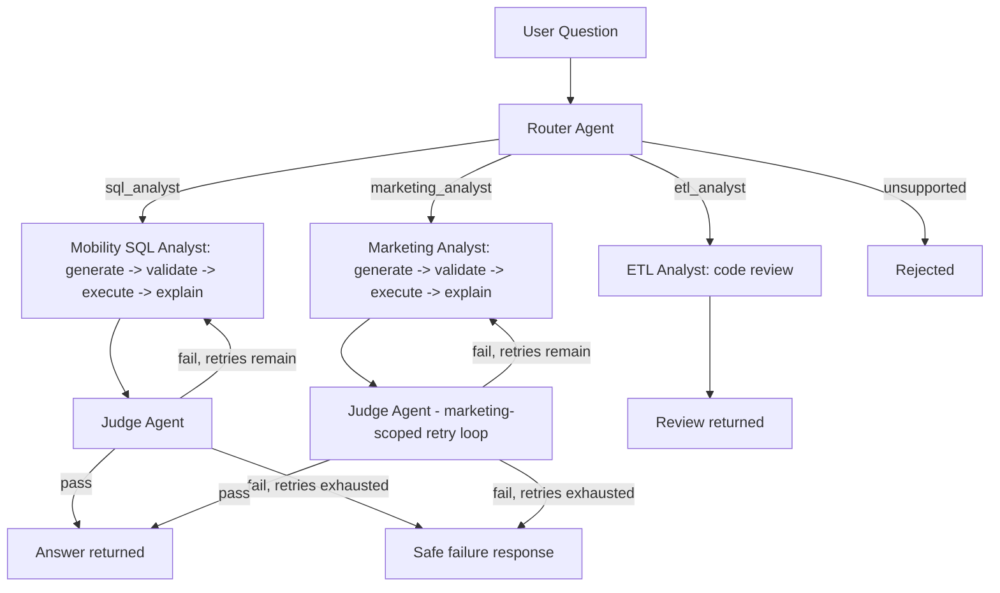

# Multi-Agent AI Data Analytics Platform

A production-style multi-agent system that answers natural-language questions across multiple business domains and reviews ETL code for data-quality issues - built with an emphasis on **verifiable safety** rather than blind trust in AI-generated output.

A user asks a question in plain English. A Router agent classifies intent - by domain and by task type - and rejects unsafe or out-of-scope requests. A domain-specific Analyst agent writes and validates SQL, executes it read-only, and explains the result in plain business language. A Judge agent independently checks the answer against the raw data before it reaches the user, with a bounded automatic retry loop on failure. An ETL Analyst agent separately reviews pipeline code for bugs. Every request is traced end-to-end.

**Two business domains are currently supported, proving the architecture generalizes rather than being a one-off:**
- **Mobility/rides** (customers, drivers, rides, payments, locations, driver ratings)
- **Marketing attribution** (campaigns, channel-level attribution, first-touch/last-touch/linear attribution models, ROAS) - modeled on a real Snowflake-based production project ([marketing-attribution-and-campaign-measurement-platform](https://github.com/vamsikrish69/marketing-attribution-and--campaign-measurement-platform))

## Architecture



Built with Python, LangChain, LangGraph, Pydantic, PostgreSQL, SQLAlchemy, and Streamlit. The LLM provider (currently Ollama, running `llama3.2:3b` fully locally) and the database backend (currently Postgres) are both swapped via a config value, not a code change - see "Design decisions" below.

## Security model: defense in depth, per domain

Two independent layers per domain, so a bug in one does not compromise the data, and one domain can never reach another domain's tables:

1. **Structural SQL validation** (`sqlglot`-based, not keyword-matching) - `validate_sql()` takes an explicit `allowed_tables` set per domain (`MOBILITY_ALLOWED_TABLES`, `MARKETING_ALLOWED_TABLES`), so a marketing question can never even structurally reach a mobility table, and vice versa. A dedicated pytest test (`test_marketing_table_is_blocked_under_mobility_scope`) proves this isolation directly.
2. **A dedicated read-only PostgreSQL role per domain** (`agent_readonly` for mobility, `marketing_readonly` for marketing, in separate databases) - the application executes all AI-generated queries through a role that is physically incapable of writing, regardless of what the validator does or doesn't catch.

A real example from testing: the mobility SQL generator once produced a `UNION ALL SELECT * FROM <every table>` query attempting to dump the entire database. The structural validator correctly rejected it on all 3 retry attempts, because `UNION` is not a `SELECT`-shaped statement.

## Design decisions

- **`DatabaseAdapter` abstraction** (`src/ai_data_agent/db/`): agents never talk to Postgres directly. They depend only on an abstract contract (`execute_query`, `get_schema_summary`, `close`). A `SnowflakeAdapter` implementing the same contract exists alongside `PostgresAdapter`, proving the system can swap warehouses via one config value (`DB_PROVIDER`) with zero changes to agent logic. (The marketing domain's real production data lives in Snowflake; this project currently mirrors that schema in local Postgres since Snowflake trial access was unavailable during development - swapping to the real Snowflake source is exactly the config change this adapter was built to support.)
- **Provider-agnostic LLM interface** (`src/ai_data_agent/llm/provider.py`): agents ask for a chat model, not for Ollama specifically. Swapping to a hosted model provider is a config change.
- **A narrowed, honest Judge**: an early, broader Judge prompt proved unreliable on a 3B-parameter local model - it failed genuinely correct answers over confused, overly literal reasoning. Rather than ship a Judge that produced false confidence, its scope was deliberately narrowed to a single, reliably-checkable task (does the stated number match the query result?), with the remaining gap documented rather than hidden. The same narrowed Judge is reused unchanged across both domains.
- **Adding a second domain required no new security code**: the Marketing Analyst agent reuses `validate_sql()`, `PostgresAdapter`, `get_chat_model()`, and the Judge pattern unchanged. The only new work was a domain-specific prompt and table list, plus one new Router category and two new graph nodes with their own isolated retry loop - concrete evidence the architecture pattern generalizes rather than being tuned to one dataset.

## Known limitations (documented, not hidden)

**From the mobility domain:**
- The SQL generator can hallucinate invalid filter values (e.g. inventing a status like `'no-show'` that doesn't exist in the schema) when a question is phrased ambiguously. Caught by neither the structural validator (checks safety, not semantic correctness) nor the current Judge (checks number-matching, not query intent). Logged as a named case in the eval dataset.
- The Router is not fully deterministic even at `temperature=0` on this model - the same question can occasionally route differently between runs.
- The Judge occasionally raises stylistic objections despite being explicitly instructed to ignore wording.

**From building the marketing domain (new, and independently reproducing the same underlying limitation):**
- Even MANDATORY, explicitly-stated multi-part prompt instructions are not reliably all followed by this model - a requirement to always name the attribution model used was dropped in one test run despite being marked mandatory and backed by a self-check instruction.
- A "self-check your own answer" prompting technique, added to try to fix the above, instead leaked the model's internal reasoning (e.g. "I've confirmed my answer satisfies both MANDATORY rules...") directly into the user-facing answer in one run - a new, distinct failure mode from the intended fix.
- ROAS phrasing was inconsistent within a single answer (used both a dollar figure and a ratio in the same response), despite an explicit instruction to always use a ratio.

These three marketing-domain findings are independent, reproducible evidence that the earlier Judge limitation is a general property of this small local model under compound instructions, not an artifact specific to the mobility dataset or the Judge's particular prompt.

This is a verified prototype of the architecture pattern, not a production deployment - see the "Path to production" section below for the concrete gap list.

## Evaluation

An 8-case eval dataset (`tests/fixtures/eval_dataset.json`) spans valid, ambiguous, adversarial, unsafe, and out-of-scope categories for the mobility domain, run automatically end-to-end through the full graph (`tests/run_eval.py`). Current score: 6/8 (75%), with both failures analyzed and documented in `tests/fixtures/eval_findings.md`. 13 additional pytest unit tests cover the SQL validator (including a dedicated cross-domain isolation test) and state schema deterministically. Marketing-domain eval cases are a planned next extension.

## Path to production

This project deliberately proves a pattern rather than being production-ready as-is. The concrete gaps to close:
- Async/queued request handling instead of synchronous, blocking calls
- A hosted or higher-throughput model instead of a local 3B model, for concurrency and reliability
- Connection pooling tuned for concurrent users
- Shipping the existing structured traces to a real observability platform with alerting
- Role-based access control per user/stakeholder
- A CDC-fed incremental data pipeline instead of a static seed dataset
- Reconnecting the marketing domain to its real Snowflake source via the existing `SnowflakeAdapter`

## Running it locally

```bash
git clone https://github.com/vamsikrish69/Multi-Agent-AI-Data-Analytics-Platform.git
cd Multi-Agent-AI-Data-Analytics-Platform
python -m venv .venv
.venv\Scripts\activate          # Windows
pip install -e ".[dev]"
cp .env.example .env            # fill in real values
docker compose up -d            # starts Postgres
Get-Content scripts\seed_db.sql | docker exec -i ai-data-agent-postgres psql -U agent_admin -d mobility
docker exec -it ai-data-agent-postgres psql -U agent_admin -d postgres -c "CREATE DATABASE marketing_attribution;"
Get-Content scripts\seed_marketing_db.sql | docker exec -i ai-data-agent-postgres psql -U agent_admin -d marketing_attribution
streamlit run streamlit_app\app.py
```

Requires Ollama running locally with `llama3.2:3b` pulled (or reconfigure `LLM_PROVIDER`/`LLM_MODEL_NAME` in `.env` for a different provider).

## Tests

```bash
pytest tests/unit/ -v
python tests/run_eval.py
```
